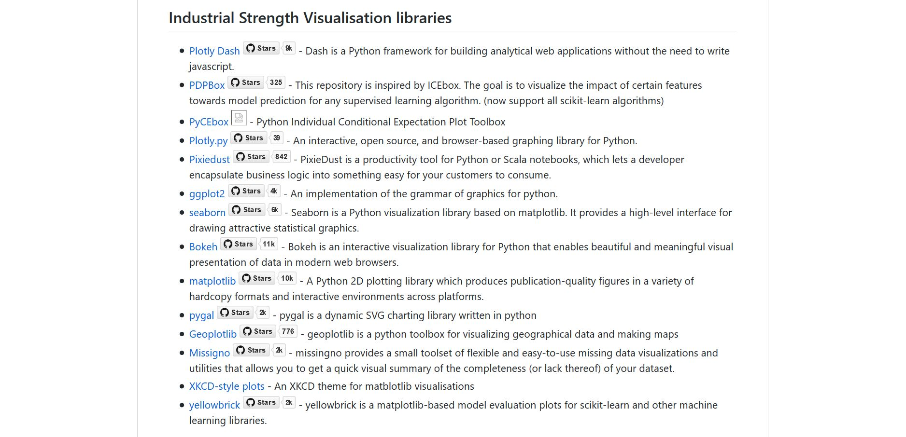
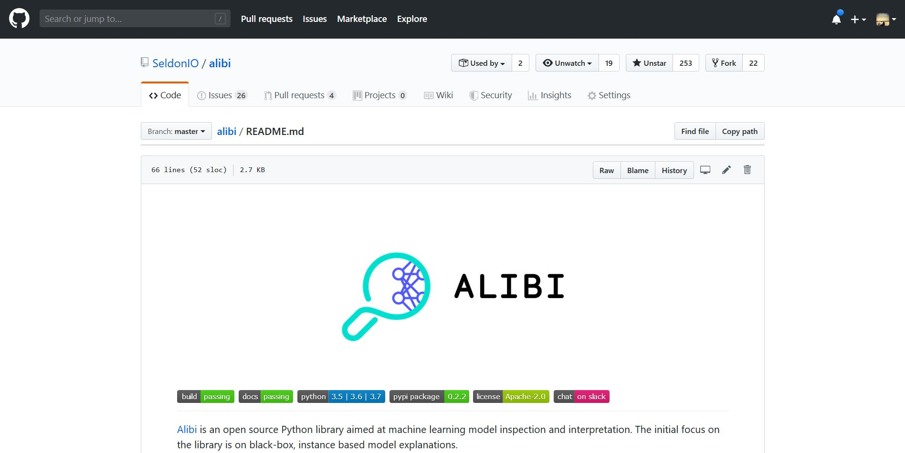
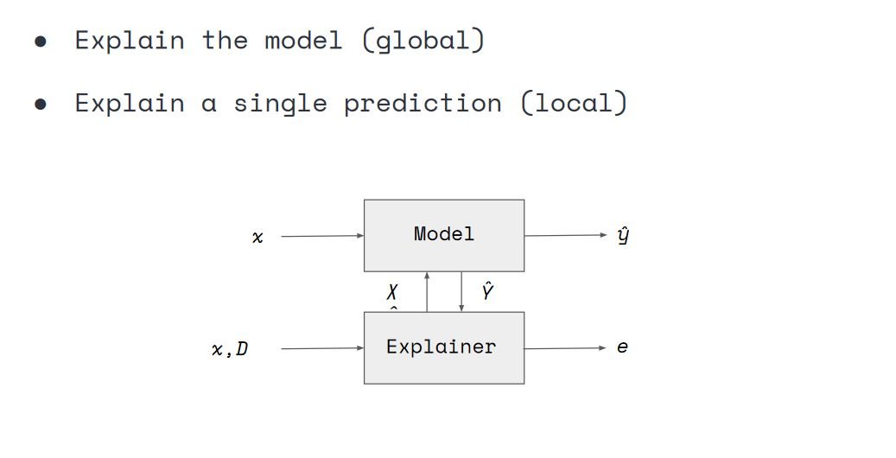
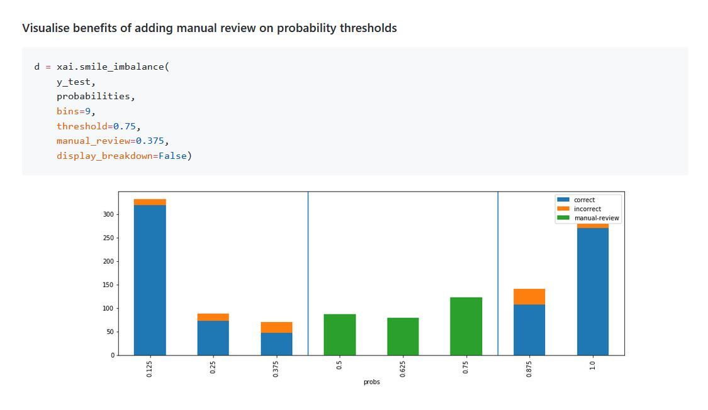

# A practical guide towards explainability
# and bias evaluation in machine learning

<br>
<br>
<br>
<br>
<br>

<br>

<br>

<br>
<br>

<h2>Alejandro Saucedo</h2>
<br>
Chief Scientist, The Institute for Ethical AI & Machine Learning
<br>
Director of ML Engineering, Seldon Technologies

<br>

<br><br><br>

<hr>


# Today

<br>
<br>

## 1) Hands on example: Company "Hype-ML" automating loan approval process 

<br>
<br>

## 2) Terminology + why it's not about "just removing bias"

<br>
<br>

## 3) Data Analysis

<br>
<br>

## 4) Model Evaluation


<br>
<br>

## 4) Production Monitoring

<br>

<br><br><br>

<hr>

# Hype-ML - A NEW Project has come in!

<br>

* Insurance company has a process where domain expert approves/rejects loan applications

<br>

* They receive over 1m applications and want to automate the process

<br>

# Business wants it NOW!

<br>

* They heard their competitor is using "Machine Learning" and business says we need to use that


<br><br><br>

<hr>

# The team had a look at how this worked

<br>


<br><br><br>

<hr>

# The team asked for DATA

<br>
<br>

## Business gave them an excel sheet with 25 rows

<br>
<br>

The team pushed back, and after a while they finally got a dataset with ~8000 rows


<br><br><br>

<hr>

<br><br><br>


# And so it begun...

<br>


<br>
<br>

## The Hype-ML journey towards greatness...

<br><br><br>

<hr>

<br><br><br>


```python
df_data, df_display = get_dataset_1()

df_display.head()

```


<div>
<style scoped>
    .dataframe tbody tr th:only-of-type {
        vertical-align: middle;
    }

    .dataframe tbody tr th {
        vertical-align: top;
    }

    .dataframe thead th {
        text-align: right;
    }
</style>
<table border="1" class="dataframe">
  <thead>
    <tr style="text-align: right;">
      <th></th>
      <th>age</th>
      <th>workclass</th>
      <th>education</th>
      <th>education-num</th>
      <th>marital-status</th>
      <th>occupation</th>
      <th>relationship</th>
      <th>ethnicity</th>
      <th>gender</th>
      <th>capital-gain</th>
      <th>capital-loss</th>
      <th>hours-per-week</th>
      <th>native-country</th>
      <th>loan</th>
    </tr>
  </thead>
  <tbody>
    <tr>
      <th>0</th>
      <td>39</td>
      <td>State-gov</td>
      <td>Bachelors</td>
      <td>13</td>
      <td>Never-married</td>
      <td>Adm-clerical</td>
      <td>Not-in-family</td>
      <td>White</td>
      <td>Male</td>
      <td>2174</td>
      <td>0</td>
      <td>40</td>
      <td>United-States</td>
      <td>False</td>
    </tr>
    <tr>
      <th>1</th>
      <td>50</td>
      <td>Self-emp-not-inc</td>
      <td>Bachelors</td>
      <td>13</td>
      <td>Married-civ-spouse</td>
      <td>Exec-managerial</td>
      <td>Husband</td>
      <td>White</td>
      <td>Male</td>
      <td>0</td>
      <td>0</td>
      <td>13</td>
      <td>United-States</td>
      <td>False</td>
    </tr>
    <tr>
      <th>2</th>
      <td>38</td>
      <td>Private</td>
      <td>HS-grad</td>
      <td>9</td>
      <td>Divorced</td>
      <td>Handlers-cleaners</td>
      <td>Not-in-family</td>
      <td>White</td>
      <td>Male</td>
      <td>0</td>
      <td>0</td>
      <td>40</td>
      <td>United-States</td>
      <td>False</td>
    </tr>
    <tr>
      <th>3</th>
      <td>53</td>
      <td>Private</td>
      <td>11th</td>
      <td>7</td>
      <td>Married-civ-spouse</td>
      <td>Handlers-cleaners</td>
      <td>Husband</td>
      <td>Black</td>
      <td>Male</td>
      <td>0</td>
      <td>0</td>
      <td>40</td>
      <td>United-States</td>
      <td>False</td>
    </tr>
    <tr>
      <th>4</th>
      <td>28</td>
      <td>Private</td>
      <td>Bachelors</td>
      <td>13</td>
      <td>Married-civ-spouse</td>
      <td>Prof-specialty</td>
      <td>Wife</td>
      <td>Black</td>
      <td>Female</td>
      <td>0</td>
      <td>0</td>
      <td>40</td>
      <td>Cuba</td>
      <td>False</td>
    </tr>
  </tbody>
</table>
</div>


```python
X = df_data.drop(label_column, axis=1).copy()
y = df_data[label_column].astype(int).values.copy()

X_train, X_valid, y_train, y_valid = \
        train_test_split(X, y, test_size=0.2, random_state=7)

print("Training size:", y_train.shape, "Testing size: ", y_valid.shape)
```

    Training size: (6400,) Testing size:  (1600,)


```python
# 1 layer, 100 neurons model, with softmax (0-1 probabilities)
model = build_model(X)

model.fit(f_in(X_train), y_train, epochs=10,
    batch_size=512, shuffle=True, validation_data=(f_in(X_valid), y_valid),
    callbacks=[PlotLossesKeras()], verbose=0, validation_split=0.05,)
```


    Log-loss (cost function):
    training   (min:    0.081, max:    0.728, cur:    0.081)
    validation (min:    0.071, max:    0.642, cur:    0.071)
    
    Accuracy:
    training   (min:    0.408, max:    0.988, cur:    0.988)
    validation (min:    0.772, max:    0.988, cur:    0.988)


    <keras.callbacks.History at 0x7f2897415b70>


```python
score = model.evaluate(f_in(X_valid), y_valid, verbose=1)
print("Error %.4f: " % score[0])
print("Accuracy %.4f: " % (score[1]*100))
```

    1600/1600 [==============================] - 0s 41us/step
    Error 0.0707: 
    Accuracy 98.7500: 


# Accuracy is ~98%!

<br>
<br>
<br>
<br>

### What a better result on a Friday evening!

<br>
<br>
<br>

# Time for PROD?


<br><br><br>

<hr>

<br><br><br>


# We push to PROD!

<br>
<br>
<br>
<br>

### A few weeks go by...

<br>


<br><br><br>

<hr>

<br><br><br>


# BUZZFEED NEWS: HYPE-ML DEPLOYS RACIST SEXIST AI!!!!

<br>


<br>


# ...but... but we followed the instructions in the internet!


<br><br><br>

<hr>

<br><br><br>


# Time to diagnose!

<br>
<br>

## We ask business to gather the 110 applications in production...

<br>
<br>

## ...and label it to understand what went wrong


<br><br><br>

<hr>

<br><br><br>


```python
X_prod, y_prod = get_production_dataset()

print(X_prod.shape)
X_prod.head()
```

    (110, 13)


<div>
<style scoped>
    .dataframe tbody tr th:only-of-type {
        vertical-align: middle;
    }

    .dataframe tbody tr th {
        vertical-align: top;
    }

    .dataframe thead th {
        text-align: right;
    }
</style>
<table border="1" class="dataframe">
  <thead>
    <tr style="text-align: right;">
      <th></th>
      <th>age</th>
      <th>workclass</th>
      <th>education</th>
      <th>education-num</th>
      <th>marital-status</th>
      <th>occupation</th>
      <th>relationship</th>
      <th>ethnicity</th>
      <th>gender</th>
      <th>capital-gain</th>
      <th>capital-loss</th>
      <th>hours-per-week</th>
      <th>native-country</th>
    </tr>
  </thead>
  <tbody>
    <tr>
      <th>0</th>
      <td>-1.288936</td>
      <td>4</td>
      <td>11</td>
      <td>-0.420053</td>
      <td>4</td>
      <td>12</td>
      <td>3</td>
      <td>4</td>
      <td>0</td>
      <td>-0.145918</td>
      <td>-0.216656</td>
      <td>-0.440371</td>
      <td>39</td>
    </tr>
    <tr>
      <th>1</th>
      <td>-1.288936</td>
      <td>4</td>
      <td>15</td>
      <td>-0.031359</td>
      <td>4</td>
      <td>8</td>
      <td>3</td>
      <td>4</td>
      <td>0</td>
      <td>-0.145918</td>
      <td>-0.216656</td>
      <td>-0.035429</td>
      <td>39</td>
    </tr>
    <tr>
      <th>2</th>
      <td>-1.288936</td>
      <td>4</td>
      <td>15</td>
      <td>-0.031359</td>
      <td>4</td>
      <td>12</td>
      <td>3</td>
      <td>4</td>
      <td>0</td>
      <td>-0.145918</td>
      <td>-0.216656</td>
      <td>1.179399</td>
      <td>39</td>
    </tr>
    <tr>
      <th>3</th>
      <td>1.643522</td>
      <td>4</td>
      <td>15</td>
      <td>-0.031359</td>
      <td>2</td>
      <td>10</td>
      <td>0</td>
      <td>4</td>
      <td>1</td>
      <td>-0.145918</td>
      <td>-0.216656</td>
      <td>0.126548</td>
      <td>39</td>
    </tr>
    <tr>
      <th>4</th>
      <td>-1.288936</td>
      <td>4</td>
      <td>15</td>
      <td>-0.031359</td>
      <td>4</td>
      <td>8</td>
      <td>1</td>
      <td>4</td>
      <td>0</td>
      <td>-0.145918</td>
      <td>-0.216656</td>
      <td>-0.035429</td>
      <td>39</td>
    </tr>
  </tbody>
</table>
</div>


```python
score = model.evaluate(f_in(X_prod), y_prod, verbose=1)
probabilities = model.predict(f_in(X_prod))
pred = f_out(probabilities)
print("Accuracy %.4f: " % (score[1]*100))
```

    110/110 [==============================] - 0s 73us/step
    Accuracy 54.5455: 


```python
xai.confusion_matrix_plot(y_prod, pred)
```


```python
xai.roc_plot(y_prod, pred) 
```


    ([array([0., 1.]), array([0., 1.])], [array([0., 1.]), array([0., 1.])])


```python
fig, ax = plt.subplots(1,2)
a = sn.countplot(y_valid, ax=ax[0]); a.set_title("TRAINING DATA"); a.set_xticklabels(["Rejected", "Approved"])
a = sn.countplot(y_prod, ax=ax[1]); a.set_title("PRODUCTION"); a.set_xticklabels(["Rejected", "Approved"])
```


[Text(0, 0, 'Rejected'), Text(0, 0, 'Approved')]


# Undesired bias and explainability

<br>

* Has become popular due to several high profile incidents:

    * Amazon's "sexist" recruitment tool
    * Microsoft's "racist" chatbot
    * Negative discrimination in automated sentencing
    * Black box models with complex patterns that can't be interpretable

<br>
<br>

## Organisations cannot take on unknown risks

<br><br><br>

<hr>

<br><br><br>

# This challenge goes beyond the algorithms

<br>

### A large ethical decision should not just fall on the shoulders of a single data scientist

<br>


<br><br><br>

<hr>

<br><br><br>

# The answer is not just about "removing bias"

<br>
<br>

* Any non trivial decision (i.e. more than 1 option) holds a bias, without exceptions.
* It's impossible to "just remove bias", as the whole purpose of ML is to discriminate towards the right answer
* Societal bias carries an inherent bias - what may be "racist" for one person, may not be for another group or geography

<br>
<br>

## Let's see what "undesired bias" looks like

<br><br><br>

<hr>

<br><br><br>

# Split into two conceptual pieces

<br>
<br>

## 1) Statistical bias 

##### The "error" between from where you are to where you CAN be.

<br>
<br>

## 2) A-priori bias 

##### The "error" between where you CAN be to where you SHOULD be.

# Statistical bias: Errors in project decisions

<br>

## Sub-optimal choices of accuracy metrics / cost functions

<br>

## Sub-optimal machine learning models chosen for the task 

<br>

## Lack of infrastructure or metrics required to monitor model performance in production

<br>

## Lack of human-in-the-loop where necessary

<br>

## Not using resources at disposal (e.g. domain experts, tools, etc).

<br><br><br>

<hr>

<br><br><br>

# A-priori bias: Bias introduced through societal or scope diversions

<br>

## Sub-optimal business objectives

<br>

## Lack of understanding of the project 

<br>

## Incomplete resources (data, time, domain experts, etc)

<br>

## Incorrectly labelled data (accident vs otherwise)

<br>

## Lack of relevant skillset

<br>

## Societal shifts in perception

<br><br><br>

<hr>

<br><br><br>

# Explainability is key

<br>
<br>

* To identify and evaluate undersired biases

<br>

* For definitions of regulatory demands (GDPR)

<br>

* For compliance of processes

<br>

* To identify and reduce risks (FP vs FN)

# Key Point: Explainability !== Interpretability

<br>

*  Having a model that can be interpreted doesn't mean it can be explained

<br>

* Explainability requires us to go beyond the algorithms

<br>

* Undesired bias cannot be tackled without explainability


<br><br><br>

<hr>

<br><br><br>

# Remember our workflow? Let's add three new steps:

<br>


# Augmenting the data science workflow

<br>


<br><br><br>

<hr>

<br><br><br>

# The Explainability Tradeoff

<br>

## Introducing fail-safe mechanisms, removing features, and using simpler models may have an impact on accuracy

<br>

## Not all usecases demand the same level of scrutiny

<br>

## The ones that are more critical do require a more strict process

<br>

## Similar to enterprise software, the overhead to offer accountability and governance is introduced


<br><br><br>

<hr>

<br><br><br>


# 1) Data Analysis

<br><br><br>

<hr>

<br><br><br>

#### Points to cover

1.1) Data imbalances

1.2) Upsampling / downsampling

1.3) Correlations

1.4) Train / test set

1.5) Further techniques

# XAI - eXplainable AI 

<br>

## A set of tools to explain machine learning data

<br>


<br>

## https://github.com/EthicalML/XAI


<br><br><br>

<hr>

## Let's get the new training dataset


```python
X, y, X_train, X_valid, y_train, y_valid, X_display, y_display, df, df_display \
    = get_dataset_2()
df_display.head()
```


<div>
<style scoped>
    .dataframe tbody tr th:only-of-type {
        vertical-align: middle;
    }

    .dataframe tbody tr th {
        vertical-align: top;
    }

    .dataframe thead th {
        text-align: right;
    }
</style>
<table border="1" class="dataframe">
  <thead>
    <tr style="text-align: right;">
      <th></th>
      <th>age</th>
      <th>workclass</th>
      <th>education</th>
      <th>education-num</th>
      <th>marital-status</th>
      <th>occupation</th>
      <th>relationship</th>
      <th>ethnicity</th>
      <th>gender</th>
      <th>capital-gain</th>
      <th>capital-loss</th>
      <th>hours-per-week</th>
      <th>native-country</th>
      <th>loan</th>
    </tr>
  </thead>
  <tbody>
    <tr>
      <th>0</th>
      <td>39</td>
      <td>State-gov</td>
      <td>Bachelors</td>
      <td>13</td>
      <td>Never-married</td>
      <td>Adm-clerical</td>
      <td>Not-in-family</td>
      <td>White</td>
      <td>Male</td>
      <td>2174</td>
      <td>0</td>
      <td>40</td>
      <td>United-States</td>
      <td>False</td>
    </tr>
    <tr>
      <th>1</th>
      <td>50</td>
      <td>Self-emp-not-inc</td>
      <td>Bachelors</td>
      <td>13</td>
      <td>Married-civ-spouse</td>
      <td>Exec-managerial</td>
      <td>Husband</td>
      <td>White</td>
      <td>Male</td>
      <td>0</td>
      <td>0</td>
      <td>13</td>
      <td>United-States</td>
      <td>False</td>
    </tr>
    <tr>
      <th>2</th>
      <td>38</td>
      <td>Private</td>
      <td>HS-grad</td>
      <td>9</td>
      <td>Divorced</td>
      <td>Handlers-cleaners</td>
      <td>Not-in-family</td>
      <td>White</td>
      <td>Male</td>
      <td>0</td>
      <td>0</td>
      <td>40</td>
      <td>United-States</td>
      <td>False</td>
    </tr>
    <tr>
      <th>3</th>
      <td>53</td>
      <td>Private</td>
      <td>11th</td>
      <td>7</td>
      <td>Married-civ-spouse</td>
      <td>Handlers-cleaners</td>
      <td>Husband</td>
      <td>Black</td>
      <td>Male</td>
      <td>0</td>
      <td>0</td>
      <td>40</td>
      <td>United-States</td>
      <td>False</td>
    </tr>
    <tr>
      <th>4</th>
      <td>28</td>
      <td>Private</td>
      <td>Bachelors</td>
      <td>13</td>
      <td>Married-civ-spouse</td>
      <td>Prof-specialty</td>
      <td>Wife</td>
      <td>Black</td>
      <td>Female</td>
      <td>0</td>
      <td>0</td>
      <td>40</td>
      <td>Cuba</td>
      <td>False</td>
    </tr>
  </tbody>
</table>
</div>


## 1.1) Data imbalances
#### We can visualise the imbalances by looking at the number of examples for each class


```python
im = xai.imbalance_plot(df_display, "gender", threshold=0.55, categorical_cols=["gender"])
```


#### We can evaluate imbalances by the product of multiple categories


```python
im = xai.imbalance_plot(df_display, "gender", "loan" , categorical_cols=["loan", "gender"])
```


#### For numeric datasets we can break it down in bins


```python
im = xai.imbalance_plot(df_display, "age" , bins=10)
```

    WARNING:root:No categorical_cols passed so inferred using np.object, np.int8 and np.bool: Index(['workclass', 'education', 'marital-status', 'occupation',
           'relationship', 'ethnicity', 'gender', 'native-country', 'loan'],
          dtype='object'). If you see an error these are not correct, please provide them as a string array as: categorical_cols=['col1', 'col2', ...]


## 1.2) Upsampling / Downsampling


```python
im = xai.balance(df_display, "ethnicity", "loan", categorical_cols=["ethnicity", "loan"],
                upsample=0.5, downsample=0.5, bins=5)
```


## 1.3 Correlations hidden in data
#### We can identify potential correlations across variables through a dendogram visualiation


```python
corr = xai.correlations(df_display, include_categorical=True)
```

    /home/alejandro/miniconda3/envs/reddit-classification/lib/python3.7/site-packages/scipy/stats/stats.py:245: RuntimeWarning: The input array could not be properly checked for nan values. nan values will be ignored.
      "values. nan values will be ignored.", RuntimeWarning)


## 1.4) Balanced train/testing sets


```python
X_train_balanced, y_train_balanced, X_valid_balanced, y_valid_balanced, train_idx, test_idx = \
    xai.balanced_train_test_split(
            X, y, "gender", 
            min_per_group=300,
            max_per_group=300,
            categorical_cols=["gender", "loan"])

X_valid_balanced["loan"] = y_valid_balanced
im = xai.imbalance_plot(X_valid_balanced, "gender", "loan", categorical_cols=["gender", "loan"])
```


## 1.5 Shoutout to other tools and techniques
https://github.com/EthicalML/awesome-production-machine-learning#industrial-strength-visualisation-libraries


# 2) Model evaluation

<br><br><br>

<hr>

<br><br><br>

#### Points to cover

2.1) Standard model evaluation metrics

2.2) Global model explanation techniques

2.3) Black box local model explanation techniques

2.4) Other libraries available

# Alibi - Black Box Model Explanations

<br>

## A set of proven scientific techniques to explain ML models as black boxes

<br>



<br>

## https://github.com/SeldonIO/Alibi


<br><br><br>

<hr>

# Model Evaluation Metrics: White / Black Box


# Model Evaluation Metrics: Global vs Local



## 2.1) Standard model evaluation metrics


```python
# Let's start by building our model with our newly balanced dataset
model = build_model(X)
model.fit(f_in(X_train), y_train, epochs=20, batch_size=512, shuffle=True, validation_data=(f_in(X_valid), y_valid), callbacks=[PlotLossesKeras()], verbose=0, validation_split=0.05,)
probabilities = model.predict(f_in(X_valid))
pred = f_out(probabilities)
```


    Log-loss (cost function):
    training   (min:    0.311, max:    0.581, cur:    0.311)
    validation (min:    0.312, max:    0.464, cur:    0.312)
    
    Accuracy:
    training   (min:    0.724, max:    0.856, cur:    0.856)
    validation (min:    0.808, max:    0.857, cur:    0.857)


```python
xai.confusion_matrix_plot(y_valid, pred)
```


```python
im = xai.roc_plot(y_valid, pred)
```


```python
im = xai.roc_plot(y_valid, pred, df=X_valid, cross_cols=["gender"], categorical_cols=["gender"])
```


```python
im = xai.metrics_plot(y_valid, pred)
```


```python
im = xai.metrics_plot(y_valid, pred, df=X_valid, cross_cols=["gender"], categorical_cols="gender")
```


# 2.2) Global black box model evalutaion metrics


```python
imp = xai.feature_importance(X_valid, y_valid, lambda x, y: model.evaluate(f_in(x), y, verbose=0)[1], repeat=1)
```

    /home/alejandro/miniconda3/envs/reddit-classification/lib/python3.7/site-packages/xai/__init__.py:1127: SettingWithCopyWarning: 
    A value is trying to be set on a copy of a slice from a DataFrame.
    Try using .loc[row_indexer,col_indexer] = value instead
    
    See the caveats in the documentation: http://pandas.pydata.org/pandas-docs/stable/indexing.html#indexing-view-versus-copy
      x[c] = tmp


# 2.3) Local black box model evaluation metrics
### Overview of methods


# Anchors 

<br>

#### Consists of if-then rules, called the anchors, which sufficiently guarantee the explanation locally and try to maximize the area for which the explanation holds. (ArXiv: Anchors: High-Precision Model-Agnostic Explanations)

<br>

<div style="float: left; width: 50%">

</div>

<div style="float: left; width: 50%">

</div>


```python
from alibi.explainers import AnchorTabular

explainer = AnchorTabular(
    loan_model_alibi.predict, 
    feature_names_alibi, 
    categorical_names=category_map_alibi)

explainer.fit(
    X_train_alibi, 
    disc_perc=[25, 50, 75])

print("Explainer built")
```

    Explainer built


```python
X_test_alibi[:1]
```


    array([[52,  4,  0,  2,  8,  4,  2,  0,  0,  0, 60,  9]])


```python
explanation = explainer.explain(X_test_alibi[:1], threshold=0.95)

print('Anchor: %s' % (' AND '.join(explanation['names'])))
print('Precision: %.2f' % explanation['precision'])
print('Coverage: %.2f' % explanation['coverage'])
```

    Anchor: Marital Status = Separated AND Sex = Female AND Capital Gain <= 0.00
    Precision: 0.97
    Coverage: 0.10


# Counterfactual Explanations

### The counterfactual explanation of an outcome or a situation Y takes the form “If X had not occured, Y would not have occured” 


## 1.5 Shoutout to other tools and techniques
https://github.com/EthicalML/awesome-production-machine-learning#explaining-black-box-models-and-datasets


# 3) Production Monitoring

<br><br><br>

<hr>

<br><br><br>

#### Key points to cover

<br>

1) Design patterns for explainers

<br>

2) Live demo of explainers

<br>

3) Leveraging humans for explainers

# Seldon Core - Production ML in K8s

<br>

## A language agnostic ML serving & monitoring framework in Kubernetes

<br>


<br>

## https://github.com/SeldonIO/seldon-core


<br><br><br>

<hr>

# 3.1) Design patterns for explainers


#### Setup Seldon in your kubernetes cluster


```bash
%%bash
kubectl create clusterrolebinding kube-system-cluster-admin --clusterrole=cluster-admin --serviceaccount=kube-system:default
helm init
kubectl rollout status deploy/tiller-deploy -n kube-system
helm install seldon-core-operator --name seldon-core-operator --repo https://storage.googleapis.com/seldon-charts
helm install seldon-core-analytics --name seldon-core-analytics --repo https://storage.googleapis.com/seldon-charts
helm install stable/ambassador --name ambassador
```


```python
from sklearn.preprocessing import LabelEncoder, StandardScaler, OneHotEncoder
from sklearn.impute import SimpleImputer
from sklearn.pipeline import Pipeline
from sklearn.compose import ColumnTransformer

# feature transformation pipeline
ordinal_features = [x for x in range(len(alibi_feature_names)) if x not in list(alibi_category_map.keys())]
ordinal_transformer = Pipeline(steps=[('imputer', SimpleImputer(strategy='median')),
                                      ('scaler', StandardScaler())])

categorical_features = list(alibi_category_map.keys())
categorical_transformer = Pipeline(steps=[('imputer', SimpleImputer(strategy='median')),
                                          ('onehot', OneHotEncoder(handle_unknown='ignore'))])

preprocessor = ColumnTransformer(transformers=[('num', ordinal_transformer, ordinal_features),
                                               ('cat', categorical_transformer, categorical_features)])
```


```python
preprocessor.fit(alibi_data)
```


```python
from sklearn.ensemble import RandomForestClassifier

np.random.seed(0)
clf = RandomForestClassifier(n_estimators=50)
clf.fit(preprocessor.transform(X_train_alibi), y_train_alibi)
```


```python
!mkdir -p pipeline/pipeline_steps/loanclassifier/
```

#### Save the model artefacts so we can deploy them


```python
import dill

with open("pipeline/pipeline_steps/loanclassifier/preprocessor.dill", "wb") as prep_f:
    dill.dump(preprocessor, prep_f)
    
with open("pipeline/pipeline_steps/loanclassifier/model.dill", "wb") as model_f:
    dill.dump(clf, model_f)
```

#### Build a Model wrapper that uses the trained models through a predict function


```python
%%writefile pipeline/pipeline_steps/loanclassifier/Model.py
import dill

class Model:
    def __init__(self, *args, **kwargs):
        
        with open("preprocessor.dill", "rb") as prep_f:
            self.preprocessor = dill.load(prep_f)
        with open("model.dill", "rb") as model_f:
            self.clf = dill.load(model_f)
        
    def predict(self, X, feature_names=[]):
        X_prep = self.preprocessor.transform(X)
        proba = self.clf.predict_proba(X_prep)
        return proba
```

#### Add the dependencies for the wrapper to work


```python
%%writefile pipeline/pipeline_steps/loanclassifier/requirements.txt
scikit-learn==0.20.1
dill==0.2.9
scikit-image==0.15.0
scikit-learn==0.20.1
scipy==1.1.0
numpy==1.15.4
```


```python
!mkdir pipeline/pipeline_steps/loanclassifier/.s2i
```


```python
%%writefile pipeline/pipeline_steps/loanclassifier/.s2i/environment
MODEL_NAME=Model
API_TYPE=REST
SERVICE_TYPE=MODEL
PERSISTENCE=0
```

#### Use the source2image command to containerize code


```python
!s2i build pipeline/pipeline_steps/loanclassifier seldonio/seldon-core-s2i-python3:0.8 loanclassifier:0.1
```

#### Define the graph of your pipeline with individual models


```python
%%writefile pipeline/pipeline_steps/loanclassifier/loanclassifiermodel.yaml
apiVersion: machinelearning.seldon.io/v1alpha2
kind: SeldonDeployment
metadata:
  labels:
    app: seldon
  name: loanclassifier
spec:
  name: loanclassifier
  predictors:
  - componentSpecs:
    - spec:
        containers:
        - image: loanclassifier:0.1
          name: model
    graph:
      children: []
      name: model
      type: MODEL
      endpoint:
        type: REST
    name: loanclassifier
    replicas: 1
```

#### Deploy your model!


```python
!kubectl apply -f pipeline/pipeline_steps/loanclassifier/loanclassifiermodel.yaml
```

#### Now we can send data through the REST API


```python
X_test_alibi[:1]
```


    array([[52,  4,  0,  2,  8,  4,  2,  0,  0,  0, 60,  9]])


```bash
%%bash
curl -X POST -H 'Content-Type: application/json' \
    -d "{'data': {'names': ['text'], 'ndarray': [[52,  4,  0,  2,  8,  4,  2,  0,  0,  0, 60,  9]]}}" \
    http://localhost:80/seldon/default/loanclassifier/api/v0.1/predictions
```

    {
      "meta": {
        "puid": "96cmdkc4k1c6oassvpnpasqbgf",
        "tags": {
        },
        "routing": {
        },
        "requestPath": {
          "model": "loanclassifier:0.1"
        },
        "metrics": []
      },
      "data": {
        "names": ["t:0", "t:1"],
        "ndarray": [[0.86, 0.14]]
      }
    }

      % Total    % Received % Xferd  Average Speed   Time    Time     Time  Current
                                     Dload  Upload   Total   Spent    Left  Speed
    100   356  100   264  100    92  11000   3833 --:--:-- --:--:-- --:--:-- 15478


#### We can also reach it with the Python Client


```python
from seldon_core.seldon_client import SeldonClient

batch = X_test_alibi[:1]

sc = SeldonClient(
    gateway="ambassador", 
    gateway_endpoint="localhost:80",
    deployment_name="loanclassifier",
    payload_type="ndarray",
    namespace="default",
    transport="rest")

client_prediction = sc.predict(data=batch)

print(client_prediction.response)
```

    meta {
      puid: "hv4dnmr8m3ckgrhtnc48rs7mjg"
      requestPath {
        key: "model"
        value: "loanclassifier:0.1"
      }
    }
    data {
      names: "t:0"
      names: "t:1"
      ndarray {
        values {
          list_value {
            values {
              number_value: 0.86
            }
            values {
              number_value: 0.14
            }
          }
        }
      }
    }
    


#### Now we can create an explainer for our model


```python
from alibi.explainers import AnchorTabular

predict_fn = lambda x: clf.predict(preprocessor.transform(x))
explainer = AnchorTabular(predict_fn, alibi_feature_names, categorical_names=alibi_category_map)
explainer.fit(X_train_alibi, disc_perc=[25, 50, 75])

explanation = explainer.explain(X_test_alibi[0], threshold=0.95)

print('Anchor: %s' % (' AND '.join(explanation['names'])))
print('Precision: %.2f' % explanation['precision'])
print('Coverage: %.2f' % explanation['coverage'])
```

    Anchor: Marital Status = Separated AND Sex = Female AND Capital Gain <= 0.00
    Precision: 0.97
    Coverage: 0.10


```python

def predict_remote_fn(X):
    from seldon_core.seldon_client import SeldonClient
    from seldon_core.utils import get_data_from_proto
    
    kwargs = {
        "gateway": "ambassador", 
        "deployment_name": "loanclassifier",
        "payload_type": "ndarray",
        "namespace": "default",
        "transport": "rest"
    }
    
    try:
        kwargs["gateway_endpoint"] = "localhost:80"
        sc = SeldonClient(**kwargs)
        prediction = sc.predict(data=X)
    except:
        # If we are inside the container, we need to reach the ambassador service directly
        kwargs["gateway_endpoint"] = "ambassador:80"
        sc = SeldonClient(**kwargs)
        prediction = sc.predict(data=X)
    
    y = get_data_from_proto(prediction.response)
    return y

```

#### But now we can use the remote model we have in production


```python
# Summary of the predict_remote_fn
def predict_remote_fn(X):
    ....
    sc = SeldonClient(...)
    prediction = sc.predict(data=X)
    y = get_data_from_proto(prediction.response)
    return y
```

#### And train our explainer to use the remote function


```python
from seldon_core.utils import get_data_from_proto

explainer = AnchorTabular(predict_remote_fn, alibi_feature_names, categorical_names=alibi_category_map)
explainer.fit(X_train_alibi, disc_perc=[25, 50, 75])

explanation = explainer.explain(X_test_alibi[idx], threshold=0.95)

print('Anchor: %s' % (' AND '.join(explanation['names'])))
print('Precision: %.2f' % explanation['precision'])
print('Coverage: %.2f' % explanation['coverage'])
```

    Anchor: Marital Status = Separated AND Sex = Female
    Precision: 0.97
    Coverage: 0.11


#### To containerise our explainer, save the trained binary


```python
import dill

with open("pipeline/pipeline_steps/loanclassifier-explainer/explainer.dill", "wb") as x_f:
    dill.dump(explainer, x_f)
```

#### Expose it through a wrapper


```python
%%writefile pipeline/pipeline_steps/loanclassifier-explainer/Explainer.py
import dill
import json
import numpy as np

class Explainer:
    def __init__(self, *args, **kwargs):
        
        with open("explainer.dill", "rb") as x_f:
            self.explainer = dill.load(x_f)
        
    def predict(self, X, feature_names=[]):
        print("Received: " + str(X))
        explanation = self.explainer.explain(X)
        print("Predicted: " + str(explanation))
        return json.dumps(explanation, cls=NumpyEncoder)

    
    
    
class NumpyEncoder(json.JSONEncoder):
    def default(self, obj):
        if isinstance(obj, (
        np.int_, np.intc, np.intp, np.int8, np.int16, np.int32, np.int64, np.uint8, np.uint16, np.uint32, np.uint64)):
            return int(obj)
        elif isinstance(obj, (np.float_, np.float16, np.float32, np.float64)):
            return float(obj)
        elif isinstance(obj, (np.ndarray,)):
            return obj.tolist()
        return json.JSONEncoder.default(self, obj)
```

#### Add config files to build image with script


```python
!s2i build pipeline/pipeline_steps/loanclassifier-explainer seldonio/seldon-core-s2i-python3:0.8 loanclassifier-explainer:0.1
```


```python
!mkdir -p pipeline/pipeline_steps/loanclassifier-explainer
```


```python
%%writefile pipeline/pipeline_steps/loanclassifier-explainer/loanclassifiermodel-explainer.yaml
apiVersion: machinelearning.seldon.io/v1alpha2
kind: SeldonDeployment
metadata:
  labels:
    app: seldon
  name: loanclassifier-explainer
spec:
  name: loanclassifier-explainer
  predictors:
  - componentSpecs:
    - spec:
        containers:
        - image: loanclassifier-explainer:0.1
          name: model-explainer
    graph:
      children: []
      name: model-explainer
      type: MODEL
      endpoint:
        type: REST
    name: loanclassifier-explainer
    replicas: 1
```

#### Deploy your remote explainer


```python
!kubectl apply -f pipeline/pipeline_steps/loanclassifier-explainer/loanclassifiermodel-explainer.yaml
```

#### Now we can request explanations throught the REST API


```bash
%%bash
curl -X POST -H 'Content-Type: application/json' \
    -d "{'data': {'names': ['text'], 'ndarray': [[52,  4,  0,  2,  8,  4,  2,  0,  0,  0, 60, 9]] }}" \
    http://localhost:80/seldon/default/loanclassifier-explainer/api/v0.1/predictions
```

    {
      "meta": {
        "puid": "ohbll5bcpu9gg7jjj1unll4155",
        "tags": {
        },
        "routing": {
        },
        "requestPath": {
          "model-explainer": "loanclassifier-explainer:0.1"
        },
        "metrics": []
      },
      "strData": "{\"names\": [\"Marital Status = Separated\", \"Sex = Female\"], \"precision\": 0.9629629629629629, \"coverage\": 0.1078, \"raw\": {\"feature\": [3, 7], \"mean\": [0.9002808988764045, 0.9629629629629629], \"precision\": [0.9002808988764045, 0.9629629629629629], \"coverage\": [0.1821, 0.1078], \"examples\": [{\"covered\": [[46, 4, 4, 2, 2, 1, 4, 1, 0, 0, 45, 9], [24, 4, 1, 2, 6, 3, 2, 1, 0, 0, 40, 9], [39, 4, 4, 2, 4, 1, 4, 1, 4650, 0, 44, 9], [40, 4, 0, 2, 5, 4, 4, 0, 0, 0, 32, 9], [39, 4, 1, 2, 8, 0, 4, 1, 3103, 0, 50, 9], [45, 4, 1, 2, 6, 5, 4, 0, 0, 0, 42, 9], [41, 4, 1, 2, 5, 1, 4, 1, 0, 0, 40, 9], [40, 4, 4, 2, 2, 0, 4, 1, 0, 0, 40, 9], [58, 4, 3, 2, 2, 2, 4, 0, 0, 0, 45, 5], [23, 4, 1, 2, 5, 1, 4, 1, 0, 0, 50, 9]], \"covered_true\": [[33, 4, 4, 2, 2, 0, 4, 1, 0, 0, 40, 9], [70, 0, 4, 2, 0, 0, 4, 1, 0, 0, 10, 9], [66, 0, 4, 2, 0, 0, 4, 1, 0, 0, 30, 9], [37, 1, 1, 2, 8, 2, 4, 0, 0, 0, 50, 9], [32, 4, 5, 2, 6, 5, 4, 0, 0, 0, 45, 9], [24, 4, 4, 2, 7, 1, 4, 1, 0, 0, 40, 9], [46, 7, 6, 2, 5, 1, 4, 0, 0, 1564, 55, 9], [28, 4, 4, 2, 2, 3, 4, 0, 0, 0, 40, 9], [28, 4, 4, 2, 2, 0, 4, 1, 3411, 0, 40, 9], [45, 4, 0, 2, 2, 0, 4, 1, 0, 0, 40, 9]], \"covered_false\": [[51, 4, 6, 2, 5, 1, 4, 0, 0, 2559, 50, 9], [35, 4, 1, 2, 5, 0, 4, 1, 0, 0, 48, 9], [48, 4, 5, 2, 5, 0, 4, 1, 0, 0, 40, 9], [41, 4, 5, 2, 8, 0, 4, 1, 0, 1977, 65, 9], [51, 6, 5, 2, 8, 4, 4, 1, 25236, 0, 50, 9], [46, 4, 4, 2, 2, 0, 4, 1, 0, 0, 75, 9], [52, 6, 1, 2, 1, 5, 4, 0, 99999, 0, 30, 9], [55, 2, 5, 2, 8, 0, 4, 1, 0, 0, 55, 9], [46, 4, 3, 2, 5, 4, 0, 1, 0, 0, 40, 9], [39, 4, 6, 2, 8, 5, 4, 0, 15024, 0, 47, 9]], \"uncovered_true\": [], \"uncovered_false\": []}, {\"covered\": [[52, 4, 4, 2, 1, 4, 4, 0, 0, 1741, 38, 9], [38, 4, 4, 2, 1, 3, 4, 0, 0, 0, 40, 9], [53, 4, 5, 2, 5, 4, 4, 0, 0, 1876, 38, 9], [54, 4, 4, 2, 8, 1, 4, 0, 0, 0, 43, 9], [43, 2, 1, 2, 5, 4, 4, 0, 0, 625, 40, 9], [27, 1, 4, 2, 8, 4, 2, 0, 0, 0, 40, 9], [47, 4, 4, 2, 1, 1, 4, 0, 0, 0, 35, 9], [54, 4, 4, 2, 8, 4, 4, 0, 0, 0, 40, 3], [43, 4, 4, 2, 8, 1, 4, 0, 0, 0, 50, 9], [53, 4, 4, 2, 5, 1, 4, 0, 0, 0, 40, 9]], \"covered_true\": [[54, 4, 4, 2, 8, 4, 4, 0, 0, 0, 40, 3], [41, 4, 4, 2, 1, 4, 4, 0, 0, 0, 40, 9], [58, 4, 4, 2, 1, 1, 4, 0, 0, 0, 40, 9], [36, 4, 4, 2, 6, 1, 4, 0, 3325, 0, 45, 9], [29, 4, 0, 2, 1, 1, 4, 0, 0, 0, 40, 9], [35, 4, 4, 2, 8, 4, 4, 0, 0, 0, 40, 9], [39, 4, 4, 2, 7, 1, 4, 0, 0, 0, 40, 8], [42, 4, 4, 2, 1, 4, 2, 0, 0, 0, 41, 9], [37, 7, 4, 2, 7, 3, 4, 0, 0, 0, 40, 9], [47, 4, 4, 2, 1, 1, 4, 0, 0, 0, 38, 9]], \"covered_false\": [[55, 5, 4, 2, 6, 4, 4, 0, 0, 0, 50, 9], [33, 7, 2, 2, 5, 5, 4, 0, 0, 0, 48, 9], [39, 4, 6, 2, 8, 5, 4, 0, 15024, 0, 47, 9], [48, 4, 5, 2, 8, 4, 4, 0, 0, 0, 40, 9], [41, 4, 1, 2, 5, 1, 4, 0, 0, 0, 50, 9], [42, 1, 5, 2, 8, 1, 4, 0, 14084, 0, 60, 9], [51, 4, 6, 2, 5, 1, 4, 0, 0, 2559, 50, 9], [52, 6, 1, 2, 1, 5, 4, 0, 99999, 0, 30, 9], [39, 7, 2, 2, 5, 1, 4, 0, 0, 0, 40, 9]], \"uncovered_true\": [], \"uncovered_false\": []}], \"all_precision\": 0, \"num_preds\": 1000101, \"names\": [\"Marital Status = Separated\", \"Sex = Female\"], \"instance\": [[52.0, 4.0, 0.0, 2.0, 8.0, 4.0, 2.0, 0.0, 0.0, 0.0, 60.0, 9.0]], \"prediction\": 0}}"
    }

      % Total    % Received % Xferd  Average Speed   Time    Time     Time  Current
                                     Dload  Upload   Total   Spent    Left  Speed
    100  3464  100  3372  100    92   3318     90  0:00:01  0:00:01 --:--:--  3409


### Now we have an explainer deployed!


# Visualise metrics and explanations 


# Leveraging Humans for Explanations




# Revisiting our workflow


# Explainability and Bias Evaluation

<br>
<br>
<br>
<br>
<br>
<br>

## Alejandro Saucedo
<br>
Chief Scientist, The Institute for Ethical AI & Machine Learning

<br>
<br>

[github.com/ethicalml/explainability-and-bias](github.com/ethicalml/bias-analysis)


<br><br><br>

<hr>

<br><br><br>

