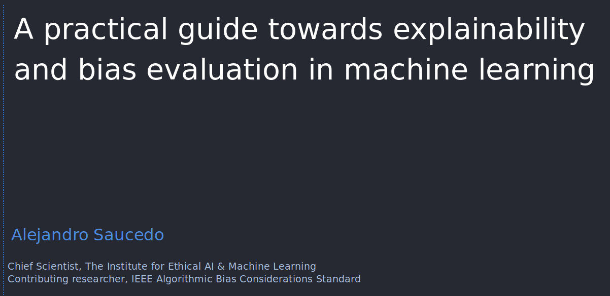

	

# A practical guide towards explainability and bias evaluation in machine learning

This repo contains the full Jupyter Notebook and code for the Python talk on machine learning explainabilty and algorithmic bias using the <a href="https://github.com/EthicalML/XAI">eXplainable AI (XAI) Python library</a>.

## YouTube Video of Talk

<table>
  <tr>
    <td width="30%">
        This <a href="https://www.youtube.com/watch?v=rq95qznOZKw">video of the talk presented at the PyCon By 2019 Conference </a> which provides an overview on the motivations for machine learning explainability as well as techniques to introduce explainability and mitigate undesired biases.
    </td>
    <td width="70%">
        
    </td>
  </tr>
</table>

## Live Reveal.JS Slides

<table>
  <tr>
    <td width="30%">
         The presentation was performed using the <a href="https://github.com/damianavila/RISE">RISE plugin</a> to convert the Jupyter notebook into a reveal.js presentation. The reveal.js presentation is hosted live in this repo under the <a href="https://ethicalml.github.io/explainability-and-bias/#/1">index.html</a> page.
    </td>
    <td width="70%">
        
    </td>
  </tr>
</table>

## eXplainable AI (XAI) Framework

<table>
  <tr>
    <td width="30%">
         The library used in the talk is the <a href="https://github.com/EthicalML/XAI">XAI (eXplainableAI)</a> library maintained by The Institute for Ethical AI & Machine Learning.
    </td>
    <td width="70%">
        
    </td>
  </tr>
</table>

